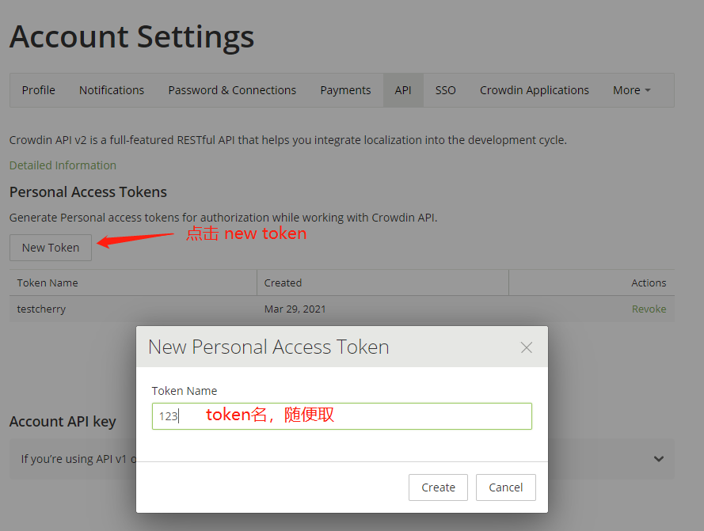
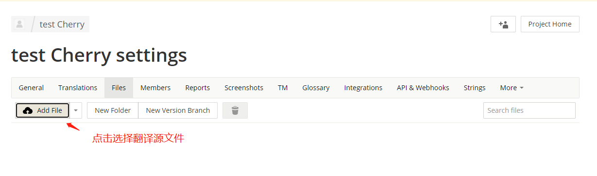

# 官网

[https://accounts.crowdin.com](https://accounts.crowdin.com/login)

# 费用

个人版提供免费14天体验，团队使用费用按年付费最低为 $40每月，按月付费最低为$49每月。

# 注册

# 创建项目

> 进入首页后点击上方 **projects**, 选择 **Create Projects**

> 填写项目信息

> 创建成功会跳转到项目主页

# 需要提供给开发的信息

> 1. **projectId**

2. 上传的源文件的文件名，点击 settings >  files

3. **接口请求的token**

点击 创建后会重新输入密码，确认密码后会弹出 token 弹窗， **复制 token** 保存好

# 添加翻译文件

# 开始翻译

**翻译完成后点击菜单按钮，展开侧栏，切换其他语言进行翻译**

**选择其他需要进行翻译的语言**

# 自动翻译功能（支持部分语言，支持简体中文）

# 更新翻译源文件

